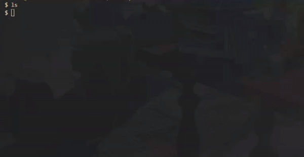

# 🖥️ TPE Monitor

Dashboard TUI pour le monitoring de terminaux de paiement.



## 🚀 Installation & Lancement
```bash
# Cloner et lancer
git clone https://github.com/Mocky-FS/tpe-monitor.git
cd tpe-monitor
go run cmd/main.go
```

## ⌨️ Utilisation

- `↑↓` : Naviguer
- `r` : Refresh manuel
- `q` : Quitter

Auto-refresh toutes les 10 secondes.

## 🛠️ Stack

- Go 1.25
- [Bubble Tea](https://github.com/charmbracelet/bubbletea) - TUI framework
- [go-humanize](https://github.com/dustin/go-humanize) - Date formatting

## 📁 Structure
```
cmd/main.go              # Point d'entrée
internal/model/          # Logique Bubble Tea
internal/terminal/       # Données des terminaux
```

## 🎯 Contexte

Projet démo pour candidature chez Afsol Perpignan (solutions mPOS/monitoring de flottes TPE).

---

**Auteur** : [Mocky-FS](https://github.com/Mocky-FS)
